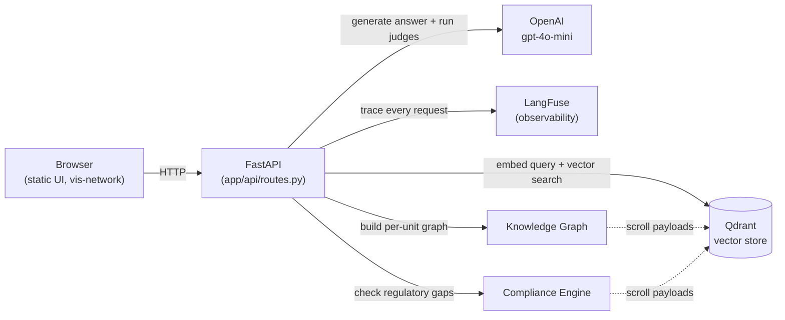

# MechMind

**MechMind — an AI maintenance assistant for industrial equipment, grounded in real manuals and maintenance history, not hallucinated guesses.**


[](https://github.com/Akshu2811/MechMind/actions/workflows/tests.yml)

## Live Demo

**[https://mechmind-api-10z7.onrender.com/](https://mechmind-api-10z7.onrender.com/)**

Hosted on Render's free tier — if it hasn't had traffic recently, the first request may take 30-60 seconds while the instance cold-starts. Subsequent requests are fast.

## The Problem

Industrial maintenance teams lose real time hunting across scattered PDFs, equipment manuals, and paper or spreadsheet maintenance logs just to answer routine questions like "what does this alarm code mean" or "has this unit had this problem before." That knowledge is also concentrated in a shrinking pool of experienced technicians — when they retire or move on, the institutional knowledge of *why* a unit behaves a certain way often leaves with them, undocumented. MechMind makes an equipment fleet's manuals, maintenance history, and regulatory obligations queryable, cross-referenced, and auditable through one interface instead of three disconnected ones.

## Architecture



The FastAPI backend is the single entry point. `/ask` embeds the question, retrieves relevant chunks from Qdrant, generates an answer with gpt-4o-mini, and runs two LLM-as-judge evaluators (groundedness, relevance) — the whole request is traced end-to-end in LangFuse. The Knowledge Graph and Compliance services are separate read paths that scroll the same Qdrant collection's payloads (no second database, no separate ingestion) to build a per-equipment relationship graph and check regulatory compliance gaps, respectively.

## Key Features

- **RAG-based Q&A grounded in real equipment manuals and maintenance logs.** Answers are generated strictly from retrieved context, never general knowledge. Retrieval uses dual-perspective search when a specific unit is named: it guarantees a minimum share of manual content in the result set (biased toward alarm/troubleshooting sections or ambient/installation sections depending on query intent) so a question isn't dominated purely by log entries.
- **Refuses to answer out-of-domain or unsupported questions.** If the retrieved context doesn't support an answer — an off-topic question, or one about equipment that doesn't exist in the fleet — the system responds with an explicit "I don't have enough information" rather than guessing. Validated in `docs/golden_set_validation.md`.
- **Interactive knowledge graph per equipment unit**, built with NetworkX server-side and rendered client-side with vis-network: Equipment, Document, AlarmCode, and LogEntry nodes with typed relationships, color-coded by alarm severity, force-directed layout, hover-to-highlight.
- **Regulatory compliance gap detection** against a synthetic inspection-interval and alarm-resolution-time standard (`data/manuals/regulatory_standards.md`), flagging units whose last inspection or open Critical/Safety alarm has exceeded its allowed window — with the specific reason surfaced, not just a pass/fail flag.
- **Full observability.** Every `/ask` request is traced in LangFuse (retrieval, generation, both judges), with automated groundedness/relevance scoring surfaced directly in the API response and the UI, not just logged for later review.

## Tech Stack

- **Backend:** FastAPI, Python 3.13
- **LLM / RAG:** OpenAI (`gpt-4o-mini`), LangChain (`langchain-openai`)
- **Vector store:** Qdrant Cloud
- **Observability:** LangFuse (traces, LLM-as-judge scoring)
- **Knowledge graph:** NetworkX (server-side graph construction), vis-network (client-side rendering)
- **Testing / CI:** pytest, GitHub Actions
- **Deployment:** Docker, Render

## Local Setup

```bash
git clone https://github.com/Akshu2811/MechMind.git
cd MechMind

python -m venv .venv
.venv\Scripts\activate      # Windows
# source .venv/bin/activate # macOS/Linux

pip install -r requirements.txt -r requirements-dev.txt

cp .env.example .env
# Fill in .env with:
#   OPENAI_API_KEY      (required — generation + embeddings + LLM judges)
#   QDRANT_URL          (required — your Qdrant Cloud/local instance)
#   QDRANT_API_KEY       (required if using Qdrant Cloud)
#   LANGFUSE_PUBLIC_KEY, LANGFUSE_SECRET_KEY, LANGFUSE_HOST  (optional —
#     observability degrades gracefully to no-op if unset/unreachable)
```

**Ingest the seed dataset.** The working `data/manuals/` and `data/logs/` are gitignored (excluded from the Docker image); `seed_data/` is the git-tracked reproducibility snapshot of that same data. Copy it into place, then run ingestion:

```bash
cp -r seed_data/manuals/* data/manuals/
cp seed_data/logs/maintenance_logs.csv data/logs/
python scripts/run_ingestion.py
```

**Run the server:**

```bash
uvicorn app.main:app --reload
```

Health check: `GET /health` → `{"status": "ok"}`. Open `http://127.0.0.1:8000` for the UI.

## Testing & CI

29 tests across three files (`tests/test_ask_endpoint.py`, `tests/test_ingestion_chunking.py`, `tests/test_retrieval_logic.py`) — all mock the Qdrant/OpenAI/LangFuse network boundary rather than calling it for real, so the suite runs with zero API keys configured.

```bash
pytest -q
```

Runs automatically on every push/PR to `main` via [GitHub Actions](https://github.com/Akshu2811/MechMind/actions/workflows/tests.yml).

## Evaluation & Observability

Every `/ask` response includes two LLM-as-judge scores computed by a second `gpt-4o-mini` call: **groundedness** (does the answer stick to the retrieved context, with no unsupported claims?) and **relevance** (does it actually address the question asked?). Both run concurrently after generation and are logged back to LangFuse as trace scores.

To check whether those judges can be trusted, `scripts/golden_set_eval.py` runs six hand-picked questions — including two designed to separate the two metrics (an off-topic question and a question about equipment that doesn't exist, both of which should be *grounded* refusals but *irrelevant* to the question asked) — against the real endpoint and compares actual scores to an independently-set expectation. Results: **[docs/golden_set_validation.md](docs/golden_set_validation.md)**.

## Cost & Scale

Real per-query cost pulled from LangFuse traces (not estimated): **~$0.00086/query**, split roughly 50/50 between the generation call and the two judge calls combined — the groundedness judge alone is nearly as expensive as generation itself, since it re-sends the full retrieved context to check the answer against it. Average end-to-end latency is **~10.5s/query** (retrieval, generation, and judges are sequential; the two judges themselves run concurrently). Full breakdown, monthly cost projections at three volumes, and ranked optimization ideas: **[docs/cost_and_scale_analysis.md](docs/cost_and_scale_analysis.md)**.

## Known Limitations

- **Single-turn only.** There is no conversation memory — each question is answered independently, with no follow-up context from prior turns in the session.
- **No rate limiting or authentication.** Any client can call `/ask` (and every other endpoint) without restriction; each call costs real money in OpenAI API usage.
- **Fully synthetic dataset**, disclosed as such throughout the manuals and logs themselves — no real industrial equipment, company, or regulation is represented or referenced.
- **Judge calibration validated on a small sample.** The golden-set check above covers 6 questions. That's enough to catch an obviously miscalibrated judge, not enough to certify calibration across the full space of question types a real deployment would see.

## Project Structure

```
app/
  api/routes.py           # All FastAPI endpoints
  services/
    ingestion.py           # Chunking + embedding pipeline (manuals + logs -> Qdrant)
    retrieval.py            # Query embedding + dual-perspective Qdrant search
    generation.py            # Answer generation + groundedness/relevance judges
    knowledge_graph.py        # NetworkX graph construction from Qdrant payloads
    compliance.py              # Regulatory compliance gap checks
    equipment_status.py         # Per-unit status/history for the sidebar UI
    observability.py             # LangFuse tracing wrapper (fails safe)
  static/index.html          # Single-page operator UI (vanilla JS, vis-network)
seed_data/                  # Git-tracked snapshot of the synthetic manuals/logs
  manuals/, logs/            # (data/ itself is gitignored; copy these in to rebuild)
scripts/
  run_ingestion.py           # Entry point to (re)build the Qdrant collection
  golden_set_eval.py          # LLM-judge calibration check against the live endpoint
  test_retrieval.py            # Standalone retrieval smoke test
tests/                       # pytest suite (29 tests)
docs/
  golden_set_validation.md    # Judge calibration report
  cost_and_scale_analysis.md   # Real cost/latency data + scale projections
```

## License / Disclaimer

This is a personal portfolio project. No license file is currently included. All equipment manuals, maintenance logs, and the regulatory standard used are fully synthetic, generated for demonstration purposes — there is no affiliation with any real manufacturer, company, or regulatory body, and nothing in this repository should be treated as real regulatory or engineering guidance.
